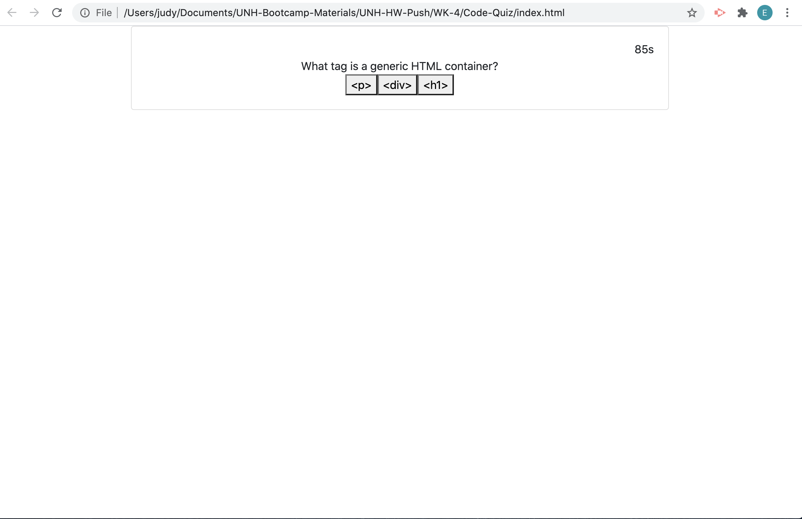

# Code Quiz

---------------------------------------- Personal Notes ----------------------------------------

DEPLOYED GITHUB PAGES LINK: https://eddiephi.github.io/Code-Quiz/

DESCRIPTION: I developed a short multiple-choice Coding Quiz using HTML, CSS Bootstrap and JavaScript Event Handling.

SCREENSHOT:

I used https://validator.w3.org/nu/ to validate my site.

Below are the guidelines I followed for this project:

